[stranger-meet.com](https://stranger-meet.com) &nbsp;·&nbsp;
[github](https://github.com/Shazil-Iqbal-Khan) &nbsp;·&nbsp;
[email](mailto:programe.codeme@gmail.com)

> BS Artificial Intelligence student at SZABIST Islamabad, Pakistan. 
> I ship real products, then make them smarter.

I build full-stack web apps and AI-powered tools, from idea to deploy. Right now that's 
[StrangerMeet](https://stranger-meet.com), a real-time voice and media-sharing platform, and 
Doctormation, an automation platform for doctors and healthcare.

<samp>python &nbsp; typescript &nbsp; javascript &nbsp; react &nbsp; node &nbsp; django &nbsp; supabase &nbsp; cloudflare &nbsp; git &nbsp; linux</samp>

**[StrangerMeet](https://github.com/Shazil-Iqbal-Khan/render-sm)** &nbsp;·&nbsp; <samp>javascript</samp> 
Omegle-style platform for meeting strangers: live voice and media sharing.

**[Doctormation](https://github.com/Shazil-Iqbal-Khan/Doctormation)** &nbsp;·&nbsp; <samp>web</samp> 
Doctors and health automation platform.

**[creator-connect-hub](https://github.com/Shazil-Iqbal-Khan/creator-connect-hub)** &nbsp;·&nbsp; <samp>typescript</samp> 
A hub that connects creators with collaborators and brands.

**[Portfolio](https://github.com/Shazil-Iqbal-Khan/Portfolio)** &nbsp;·&nbsp; <samp>typescript</samp> 
My personal portfolio site.

Every graphic here is generated, not embedded from anyone else's server. 
`ascii.svg` is a photo pushed through a character ramp by 
[`scripts/make_portrait.py`](scripts/make_portrait.py); the stat graphics and 
section headings are drawn by [a scheduled action](.github/workflows/stats.yml) 
straight from the GitHub GraphQL API, once a day, committing only what changed.

Animation is SMIL inside the SVG, because GitHub strips scripts and CSS from READMEs, 
and since nothing loads from a third party, nothing here can rate-limit or go dark. 
Design and generators adapted from [andriidrok1](https://github.com/andriidrok1/andriidrok1).
